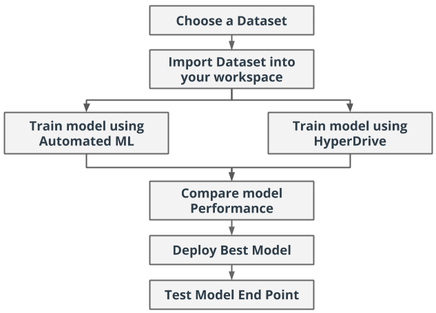

# Ultrasonic Object Recognition

Object recognition is a general term for a group of related computer vision tasks: 

- *Image classification* involves predicting the class of one object in an image. 

- *Object localization* refers to identifying the location of one or more objects in an image and drawing abounding box around their extent. 

- *Object detection* combines these two tasks and localizes and classifies one or more objects in an image.
- *Object segmentation*, also called “object instance segmentation” or “semantic segmentation”  is an extention of *object detection* where instances of recognized objects are indicated by highlighting the specific pixels of the object instead of a coarse bounding box.

In this project we will try perform object detection task on data acquired with [Ultrasonic Vision](https://github.com/emanbuc/ultrasonic-vision) system, using a small group of very low cost ultrasonic range meters.

For model creation and training we will use Azure Machine Learning SDK and we will perform model traning and deploy in Azure Machine Learning Workspace. Azure Machine Learning allow to easily create a pipeline to automatically re-train the model every time new traning data are available or when a data drift is detected.

*TODO:* Write a short introduction to your project.

## Project Workflow

In this project, you will create two models: one using Automated ML (denoted as AutoML from now on) and one customized model whose hyperparameters are tuned using HyperDrive. You will then compare the performance of both the models and deploy the best performing model. 

## Project Set Up and Installation
*OPTIONAL:* If your project has any special installation steps, this is where you should put it. To turn this project into a professional portfolio project, you are encouraged to explain how to set up this project in AzureML.

## Dataset

### Overview
*TODO*: Explain about the data you are using and where you got it from.

### Task
*TODO*: Explain the task you are going to be solving with this dataset and the features you will be using for it.

### Access
*TODO*: Explain how you are accessing the data in your workspace.

## Automated ML
*TODO*: Give an overview of the `automl` settings and configuration you used for this experiment

### Results
*TODO*: What are the results you got with your automated ML model? What were the parameters of the model? How could you have improved it?

*TODO* Remeber to provide screenshots of the `RunDetails` widget as well as a screenshot of the best model trained with it's parameters.

## Hyperparameter Tuning
*TODO*: What kind of model did you choose for this experiment and why? Give an overview of the types of parameters and their ranges used for the hyperparameter search

### Results
*TODO*: What are the results you got with your model? What were the parameters of the model? How could you have improved it?

*TODO* Remeber to provide screenshots of the `RunDetails` widget as well as a screenshot of the best model trained with it's parameters.

## Model Deployment
*TODO*: Give an overview of the deployed model and instructions on how to query the endpoint with a sample input.

## Screen Recording
*TODO* Provide a link to a screen recording of the project in action. Remember that the screencast should demonstrate:
- A working model
- Demo of the deployed  model
- Demo of a sample request sent to the endpoint and its response

## Standout Suggestions
*TODO (Optional):* This is where you can provide information about any standout suggestions that you have attempted.

- Use [Dataset Monitor](https://docs.microsoft.com/en-us/azure/machine-learning/how-to-monitor-datasets?tabs=python) to detect data drift
- Publish a pipeline for automatic model re-training
- 

## Resources

- https://www.researchgate.net/publication/337464551_Image_and_Ultrasonic_Sensor_Fusion_for_Object_Size_Detection
- https://machinelearningmastery.com/object-recognition-with-deep-learning/
- http://image-net.org/challenges/LSVRC/
- https://www.kaggle.com/c/imagenet-object-localization-challenge/overview/description
- https://www.researchgate.net/publication/345343092_Moving_Object_Detection_Using_Ultrasonic_Radar_with_Proper_Distance_Direction_and_Object_Shape_Analysis
- https://www.intorobotics.com/object-detection-hc-sr04-arduino-millis/
- https://www.intorobotics.com/interfacing-programming-ultrasonic-sensors-tutorials-resources/
- https://www.intorobotics.com/8-tutorials-to-solve-problems-and-improve-the-performance-of-hc-sr04/
- http://howtomechatronics.com/projects/arduino-radar-project/
- https://www.instructables.com/Improve-Ultrasonic-Range-Sensor-Accuracy/
- https://www.hackster.io/graham_chow/spread-spectrum-phased-array-sonar-018e22
- https://www.sciencedirect.com/science/article/abs/pii/S0921889001001269
- https://cdn.intechopen.com/pdfs/37176/InTech-Shape_recognition_and_position_measurement_of_an_object_using_an_ultrasonic_sensor_array.pdf
- https://www.mdpi.com/1424-8220/20/2/414/htm

### ONIXX on the edge (Raspeberry PI)

https://www.henkboelman.com/articles/running-win-ml-on-the-raspberry-pi/

https://qengineering.eu/deep-learning-software-for-raspberry-pi-and-alternatives.html

https://qengineering.eu/deep-learning-examples-on-raspberry-32-64-os.html

https://microsoft.github.io/ai-at-edge/docs/onnx/

https://microsoft.github.io/ai-at-edge/docs/rpi_buster/

https://medium.com/microsoftazure/the-seeing-raspberry-pi-3d66afc4a536

https://www.henkboelman.com/articles/running-win-ml-on-the-raspberry-pi/

